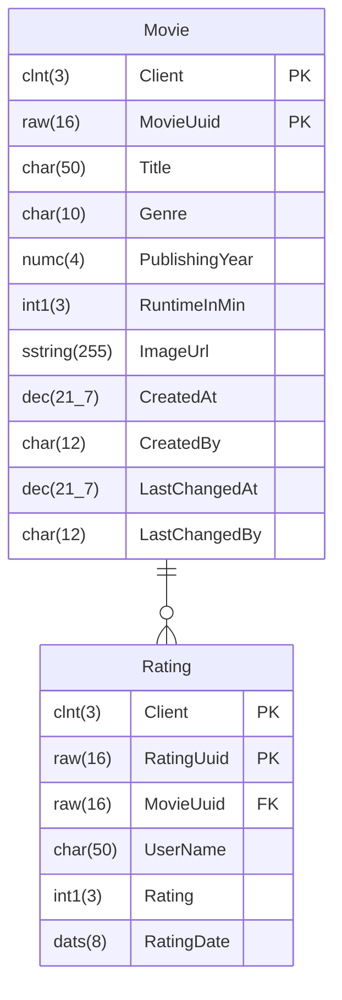
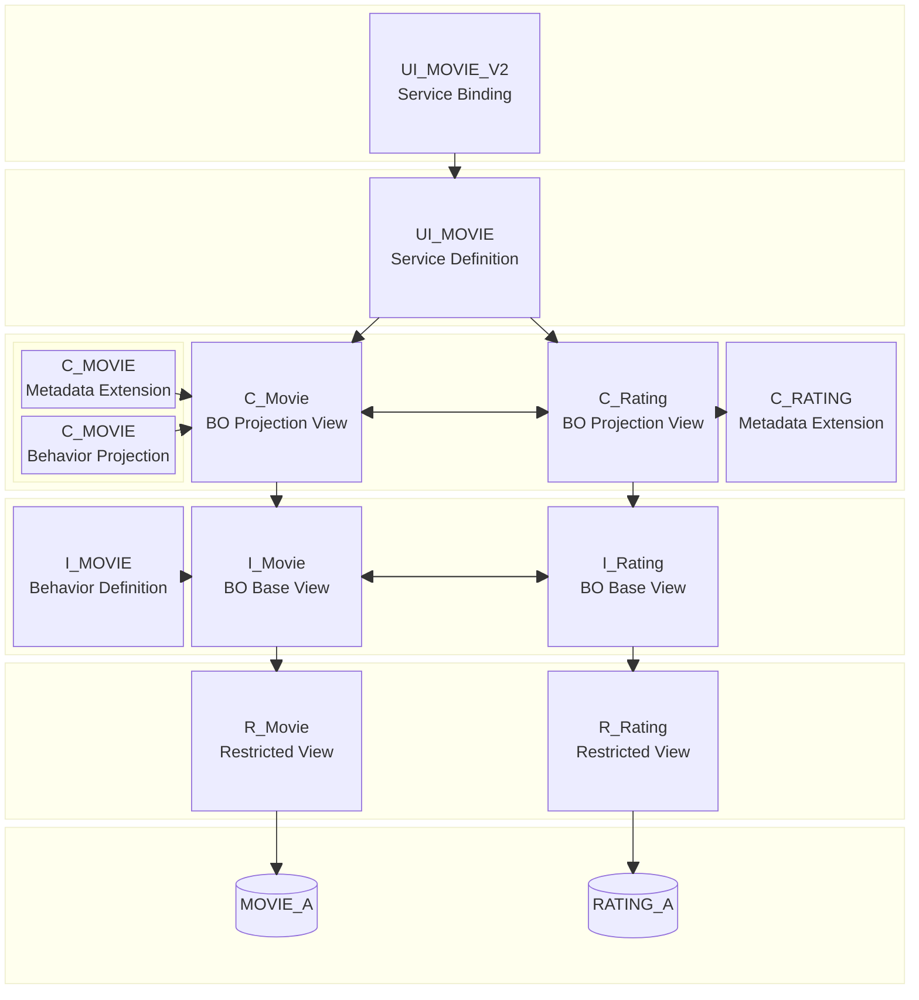
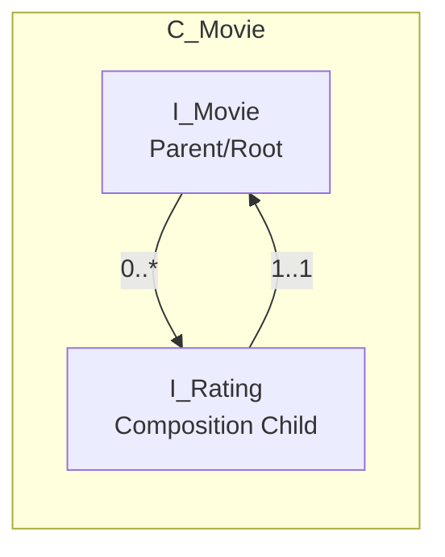

# Filmbewertungs-App

## ER-Modell

```mermaid
erDiagram
   Movie ||--o{ Rating : ""
   Movie {
      clnt(3) Client PK
      raw(16) MovieUuid PK
      char(50) Title
      char(10) Genre
      numc(4) PublishingYear
      int1(3) RuntimeInMin
      sstring(255) ImageUrl
      dec(21_7) CreatedAt
      char(12) CreatedBy
      dec(21_7) LastChangedAt
      char(12) LastChangedBy
   }
   Rating {
      clnt(3) Client PK
      raw(16) RatingUuid PK
      raw(16) MovieUuid FK
      char(50) UserName
      int1(3) Rating
      dats(8) RatingDate
   }
```

## Laufzeitartefakte

```mermaid
block-beta
   columns 1
   block
      space
      space
      UI_MOVIE_V2["UI_MOVIE_V2
                   Service Binding"]
      space
      space
   end
   block
      space
      space
      UI_MOVIE["UI_MOVIE
                Service Definition"]
      space
      space
   end
   block
      block columns 1
         C_MOVIE["C_MOVIE
                  Metadata Extension"]
         C_MOVIE2["C_MOVIE
                   Behavior Projection"]
      end
      C_Movie["C_Movie
               BO Projection View"]
      space
      C_Rating["C_Rating
                BO Projection View"]
      C_RATING["C_RATING
                Metadata Extension"]
   end
   block
      I_MOVIE["I_MOVIE
               Behavior Definition"]
      I_Movie["I_Movie
               BO Base View"]
      space
      I_Rating["I_Rating
                BO Base View"]
      space
   end
   block
      space
      R_Movie["R_Movie
               Restricted View"]
      space
      R_Rating["R_Rating
                Restricted View"]
      space
   end
   block
      space
      MOVIE_A[("MOVIE_A")]
      space
      RATING_A[("RATING_A")]
      space
   end

   UI_MOVIE_V2-->UI_MOVIE
   UI_MOVIE-->C_Movie
   UI_MOVIE-->C_Rating
   C_Movie-->I_Movie
   C_MOVIE-->C_Movie
   C_MOVIE2-->C_Movie
   C_RATING-->C_Rating
   C_Rating-->I_Rating
   C_Movie-->C_Rating
   C_Rating-->C_Movie
   I_Movie-->R_Movie
   I_MOVIE-->I_Movie
   I_Movie-->I_Rating
   I_Rating-->I_Movie
   I_Rating-->R_Rating
   R_Movie-->MOVIE_A
   R_Rating-->RATING_A
```

## Business Object

```mermaid
flowchart
   I_Movie["I_Movie
            Parent/Root"]
   I_Rating["I_Rating
             Composition Child"]
   subgraph "C_Movie"
      direction TB
      I_Movie --0..*--> I_Rating
      I_Rating --1..1--> I_Movie
   end
```
