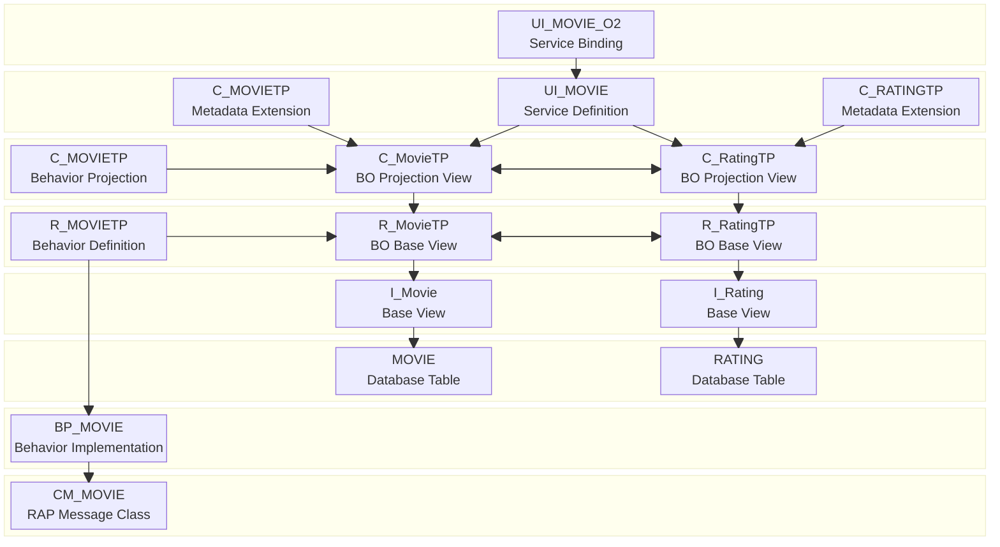
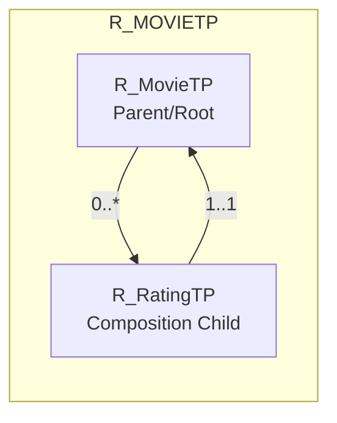

# Filmbewertungs-App

Dieses Repo beinhaltet alle notwendigen Entwicklungsobjekte sowie eine Musterlösung zur Entwicklung einer Filmbewertungs-App à la IMDB (siehe auch [Anwendungsentwicklung in SAP S/4HANA - Übungsaufgaben RAP](https://appenmaier.github.io/s4hana/exercises/rap/)). Das Arbeiten mit abapGit-Repos wird [hier](https://appenmaier.github.io/s4hana/additional-material/instructions/use-git-ondemand) beschrieben.

## Aufbau

- Im Paket `ZABAP_MOVIE_BASICS` befinden sich alle Dictionary-Objekte, die für die Entwicklung der Filmbewertungs-App erforderlich sind, eine Generatorklasse für 15 festgelegte Filme und mehrere zufällige Bewertungen (`ZABAP_MOVIE_GENERATOR`), eine Nachrichtenklasse für Filme (`ZABAP_MOVIE`) sowie eine RAP-Nachrichtenklasse für Filme (`ZCM_ABAP_MOVIE`) und eine abstrakte Oberklasse für RAP-Nachrichten (`ZCM_ABAP`)
- Im Paket `ZABAP_MOVIE_APP` befindet sich eine beispielhafte Implementierung der App (Hinweis: aktuell ist in der Musterlösung die Base View noch mit dem Prefix _ZR_ und die BO Base mit dem Prefix _ZI_ bezeichnet)

## ER-Modell

## Laufzeitartefakte

## Business Object

